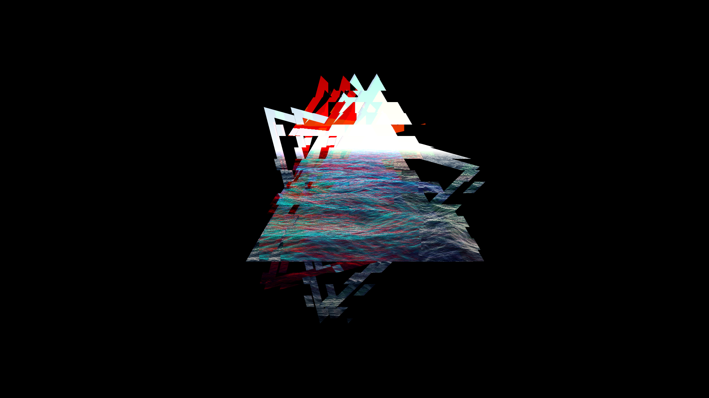
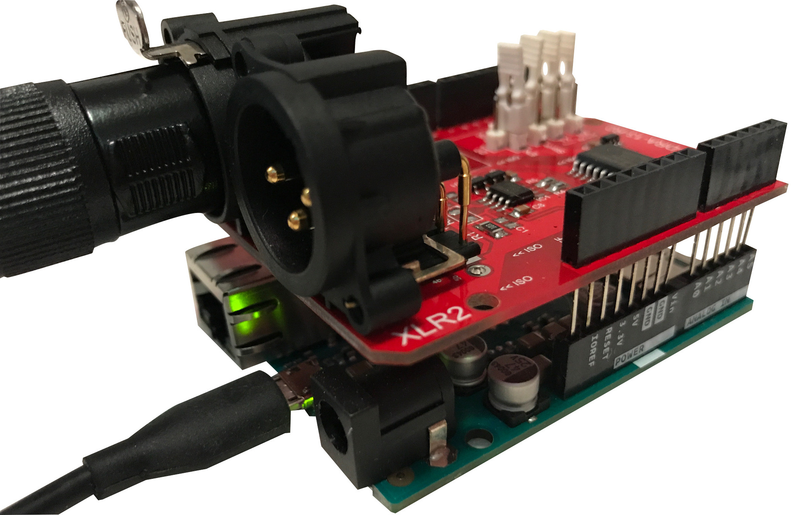
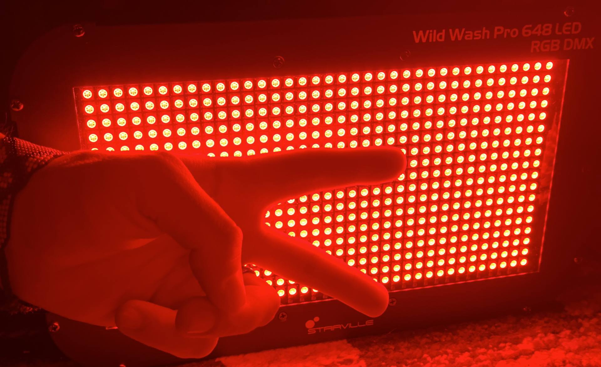

<h1>Visual & Light Workshop</h1>

Learn to create visuals and to control lights in this workshop, full of hands-on exercises. 

- [Preparations](#preparations)
  - [Nice to have](#nice-to-have)
- [Schedule](#schedule)
- [Workshop](#workshop)
  - [What are visuals & lights?](#what-are-visuals--lights)
  - [Visualize music with modV](#visualize-music-with-modv)
  - [Control lights with luminave](#control-lights-with-luminave)
  - [Connect modV & luminave with each other](#connect-modv--luminave-with-each-other)
  - [How to perform live!](#how-to-perform-live)

---

## Preparations

A list of suggestions that will make your time at the workshop even more productive:

* Bring a computer
* Check if your computer runs the latest version of each application: 
  * [Chrome](https://www.google.com/chrome/)
  * [git](https://git-scm.com/book/en/v2/Getting-Started-Installing-Git)
  * [Node.js](https://nodejs.org/en/download/package-manager/)
  * [modV](https://modv.js.org/guide/)
  * [luminave](https://github.com/NERDDISCO/luminave)

### Nice to have

The following suggestions are totally optional, so please don't worry if you can't fulfill them: 

* Coding experience  
  * We will help you if you have no idea at all
* MIDI controller that can be connected via USB to the computer
  * We will have some spare MIDI controllers for you to use, but if you want to buy one we can recommend the [KORG nanoKONTROL 2](https://www.korg.com/us/products/computergear/nanokontrol2/) because it comes for a reasonable price, is portable & has a lot of buttons, faders and knobs
    

---

## Schedule

* **Intro**: What are visuals & lights? 
* Visualize music with modV
* Control lights with luminave
* Connect modV & luminave with each other
* **Outro**: How to perform live!

---

## Workshop

### What are visuals & lights? 

   

- We want to do all of this in the browser with web technologies

---

### Visualize music with modV

- How does [modV](https://modv.js.org/) work?
  
- [Live audio analysis with Meyda](https://jsbin.com/movezix/6/edit?html,js,output)
- Use visuals from [CodePen](https://codepen.io)
- Use visuals from [Shadertoy](https://www.shadertoy.com)

---

### Control lights with luminave

- How does [luminave](https://github.com/NERDDISCO/luminave) work?
- What is DMX512?
- Build your own light (DMX512) Controller using an Arduino
  
- Let there be light
  

---

### Connect modV & luminave with each other

- WebSockets to exchange data
- Map modV output onto lights in luminave

---

###  How to perform live!

- Prepare for a show
- Use a Web MIDI controller