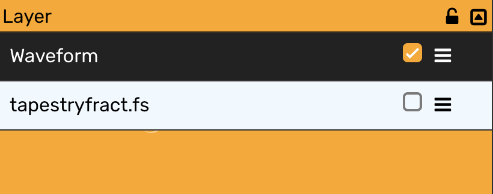
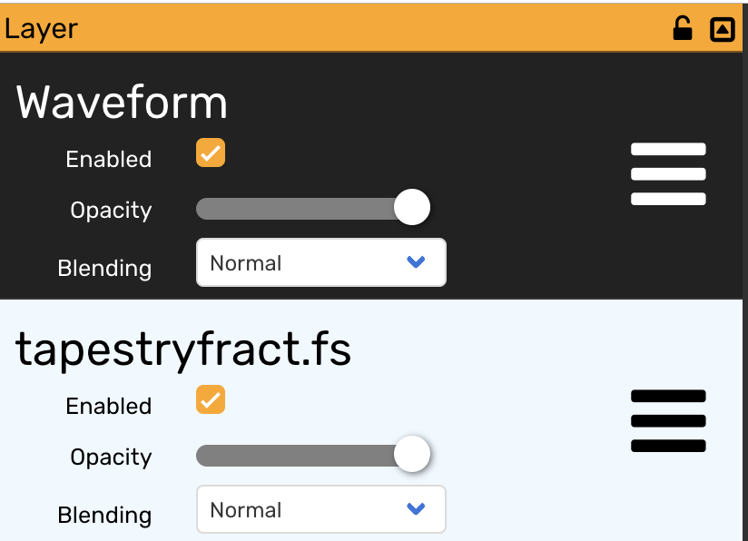

<h1>modV exercises</h1>

- [1. Start modV](#1-start-modv)
  - [Note](#note)
- [2. Add the Waveform module to a layer](#2-add-the-waveform-module-to-a-layer)
  - [Question(s)](#questions)
- [3. Change layer options](#3-change-layer-options)
- [4. Save your preset](#4-save-your-preset)
  - [Note](#note-1)
- [5. Find the media folder](#5-find-the-media-folder)
  - [Mac](#mac)
  - [Linux](#linux)
  - [Windows](#windows)
- [6. Add the tapestryfract.fs module](#6-add-the-tapestryfractfs-module)
  - [Question(s)](#questions-1)
- [7. Make the Waveform visible again by using blending](#7-make-the-waveform-visible-again-by-using-blending)
- [8. Change module properties automatically by using an LFO (Low Frequency Oscillator)](#8-change-module-properties-automatically-by-using-an-lfo-low-frequency-oscillator)
- [9. Change module properties automatically with Audio analysis](#9-change-module-properties-automatically-with-audio-analysis)
  - [Note](#note-2)
- [10. Add custom visuals from Shadertoy](#10-add-custom-visuals-from-shadertoy)
  - [Note](#note-3)
- [11. Use a MIDI controller to enable modules](#11-use-a-midi-controller-to-enable-modules)
  - [Note](#note-4)
- [12. Audio Routing](#12-audio-routing)
- [13. Import Tims preset](#13-import-tims-preset)

---

## 1. Start modV

* Open your terminal
* Go into the `modV` folder
* Execute `npm start`
* After 30 to 60 seconds modV will automatically open in Chrome, if not then go to [localhost:8080](localhost:8080)
* Chrome will ask you to give access to your webcam and microphone and MIDI, please allow all of these!
* There will be two windows, one for modV and one for the `output window` (you can close the `output window` for performance improvements)
* Find the `preview window` in the bottom right (it's a black rectangle)
* Movee the `preview window` to the bottom left by dragging (click + hold and move your mouse / trackpad)

### Note

* You can close the output window that gets opened by modV as we will use the preview window instead
* If the output window doesn't open, your browser is blocking pop-ups!

---

## 2. Add the Waveform module to a layer

* Open the `Modules` tab
* Find the `Waveform` module in the `Module 2D` section
* Add it to the layer (either drag'n' drop or doubleclick)
* Enable it to see it in your output window
* Click on the module and find the module options in the bottom left of the screen
* Play around with the `stroke`, `height` & `color` attributes

### Question(s)

* Why is the waveform moving? Where does the sound come from? 

---

## 3. Change layer options

* Click on the layer
* Find the `layer options` in the bottom right
* Activate `clearing` and deactivate `inherit`

---

## 4. Save your preset

* Open the `Presets` tab
* Enter a name for your preset
* Hit the `Save` button

### Note

* This will save your data into the media-folder that was created during startup of modV
* All your files will be there

## 5. Find the media folder

* Based on your operating system (Windows, Mac or Linux) you can find the folder in a different location:

### Mac
`~/Library/Application\ Support/modV/media/`

### Linux
`~/.config/modV/media/`

### Windows
`%appdata%\modV\media\`

* Open the preset you just saved with the editor of your choice
* You can find out more about the [folder structure in modV documentation](https://modv.js.org/guide/mediaManager.html#structure)

---

## 6. Add the tapestryfract.fs module

* Open the `Modules` tab
* Find the `tapestryfract.fs` module in the `Module ISF` section
* Add it to the layer
* The module was added on top of the layer, but we want it to be the last module in the layer (after `Waveform`), so drag'n'drop it to move it inside the layer
  * Your layer should look like this now
  
* Enable the module to see it in the output window

### Question(s)

* What happend with the Waveform? Why is it not visible anymore?

---

## 7. Make the Waveform visible again by using blending

* Disable the `tapestryfract.fs` module is the first option, but we want to see both at the same time
* This is where `blending` comes into play, but we can't see it  yet
* Open the `Plugins` tab
* Locate the `Slim UI` plugin and disable it by clicking on the button next to the name of the plugin 
  
  
* You can now see that there are even more configuration options for each module in the layer
  
* In the `Blending` dropdown select `source-in`
* The `Waveform` should be visible and instead of showing colors you see the `tapestryfract.fs`
* Play around with the other values for `blending` and also try out `opacity` of a module

## 8. Change module properties automatically by using an LFO (Low Frequency Oscillator)

* Select the `Waveform` module
* Right click on the `Stroke` attribute in the module options
* Select `Attach LFO` and then `sine`
* The `Stroke` is now updating according to a sine wave
* Right click again on the `Stroke`, select `LFO`  and then `Edit LFO`, which opens an editor to change the LFO
* Click on the checkbox `Use BPM` to not use the detected BPM
* Change the value to `5` and see that the `Stroke` is changing very fast
* Play around with `LFO` using the `LFO editor` and also use `Sawtooth`, `Square` and `Noise` 
* To remove the `LFO` again you right click on the `Stroke`, select `LFO` and then `Remove LFO`

---

## 9. Change module properties automatically with Audio analysis

* Select the `Waveform` module
* Right click on the `Stroke` attribute in the module options
* Select `Attach Feature` and then `zcr`
* The value of `Stroke` is now updating live to audio input
* Right click on the `Stroke` attriubte, select `Attach Feature` and then `Remove Feature Assignment` to remove `zcr` again
* Right click on the `Stroke` attriubte, select `Attach Feature` and then select `energy`
* You will see that the `Stroke` is near to 0, as `energy` only provides a value between 0 and 1
* Right click on the `Stroke` attribute, select `Edit expression`
* The `Expression Editor` opens, which can be used to apply math to the value of the attribute
* Inside of the editor, change the text so that it looks like this: `value * 100`
* You can now see that the value for `Stroke` is back to something visible
* Play around with the other `Audio Features` and the `Expression Editor`

### Note

* The audio analysis is provided by [Meyda](https://meyda.js.org/)
* You can find out more about the different `audio features` [in this demo](https://jsbin.com/movezix/6/edit?html,js,output)

---

## 10. Add custom visuals from Shadertoy

* Open the `Shadertoy` tab
* You see a search box to find shaders
* Type in `garden` and hit the enter key on your keyboard
* Click on `Rock Garden`
* The module was added to your modules, so open the `Modules` tab
* In the top of the screen you can find a search box, type in `Rock Garden` to filter the modules that are visible
* Add the `Rock Garden` module to your layer
* Play around with Shadertoy and find new modules

### Note

* You can't save shadertoy modules into your preset, they are gone after modV was restarted
* To actually persist them, you have to follow the [instructions in the modV documentation](https://modv.js.org/guide/writingAShaderModule.html#_1-create-a-new-file)

---

## 11. Use a MIDI controller to enable modules

* Attach a MIDI controller via USB to your computer
* Select the `Waveform` module
* Right click on the `Enable` checkbox, then select `Learn MIDI assignment`
* The next time you use your MIDI controller and push a button, modV will assign the button to the checkbox
* If your MIDI controller also has knobs or faders, you can right click on the module attribute `Height` and select `Learn MIDI assignment`
* Now move the knob or fader on your MIDI controller and see that the value of the attribute is chaning accordingly

### Note

* You can see if your MIDI controller can be used by using [the MIDI console](https://factotumo.com/web-midi-console/)

--

## 12. Audio Routing 

* Follow the [instructions in the modV documentation](https://modv.js.org/guide/audioRouting.html) for your operation system (Windows, Mac or Linux)
* Reload modV (make sure to save your preset)
* In the top right you find the menu of modV, click on the icon
* This will open a global configuration window
* The first block is called `Input`
* There you can find `Audio Input` with a dropdown
* Select the Audio Routing option of your OS and see that instead of the microphone it will use your configured audio
* Play some music and you see that your visuals react to it

## 13. Import Tims preset

* Download the preset
* Extract it
* Put it into your media folder
* Reload modV
* Load the project `timpietrusky` using the `Projects` tab
* Load the preset `timpietrusky-live-2019`